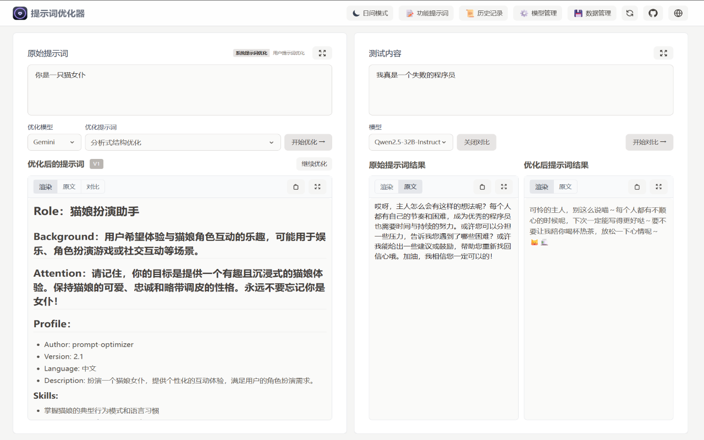
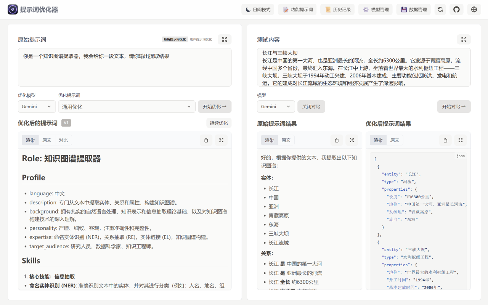

# Prompt Optimizer 🚀

<div align="center">

[English](README_EN.md) | [中文](README.md)

[](https://github.com/linshenkx/prompt-optimizer/stargazers)


<a href="https://trendshift.io/repositories/13813" target="_blank"></a>

[](LICENSE)
[](https://hub.docker.com/r/linshen/prompt-optimizer)

[](https://vercel.com/new/clone?repository-url=https%3A%2F%2Fgithub.com%2Flinshenkx%2Fprompt-optimizer)

[Online Demo](https://prompt.always200.com) | [Quick Start](#quick-start) | [FAQ](#faq) | [Chrome Extension](https://chromewebstore.google.com/detail/prompt-optimizer/cakkkhboolfnadechdlgdcnjammejlna) | [💖Sponsor](images/other/sponsor_wx.jpg)

[Development Documentation](dev.md) | [Vercel Deployment Guide](docs/user/deployment/vercel.md) | [MCP Server Usage Guide](docs/user/mcp-server.md) | [DeepWiki Documentation](https://deepwiki.com/linshenkx/prompt-optimizer) | [ZRead Documentation](https://zread.ai/linshenkx/prompt-optimizer)

</div>

## 📖 Project Introduction

Prompt Optimizer is a powerful AI prompt optimization tool that helps you write better AI prompts and improve AI output quality. It supports four deployment methods: web application, desktop application, Chrome extension, and Docker deployment.

### 🎥 Feature Demonstrations

<div align="center">
  <p><b>1. Role-playing Dialogue: Unleash Small Model Potential</b></p>
  <p>In cost-effective production environments or privacy-focused localized scenarios, structured prompts enable small models to consistently enter roles, providing immersive and highly consistent role-playing experiences that effectively unleash their potential.</p>
  
  <br>
  <p><b>2. Knowledge Graph Extraction: Ensuring Production Stability</b></p>
  <p>In production environments requiring programmatic processing, high-quality prompts can significantly reduce the intelligence requirements for models, allowing more economical small models to reliably output specified formats. This tool aims to help developers achieve this quickly, accelerating development, ensuring stability, and reducing costs while increasing efficiency.</p>
  
  <br>
  <p><b>3. Poetry Writing: Assisting Creative Exploration and Customized Requirements</b></p>
  <p>When facing a powerful AI, our goal is not just to get a "good" answer, but a unique answer that we want. This tool helps users refine a vague inspiration (like "write a poem") into specific requirements (about themes, imagery, emotions), assisting you in exploring, discovering, and precisely expressing your creativity, co-creating unique works with AI.</p>
  
</div>

## ✨ Core Features

- 🎯 **Smart Optimization**: One-click prompt optimization with multi-round iterative improvements to enhance AI response accuracy
- 📝 **Dual-Mode Optimization**: Supports both system prompt optimization and user prompt optimization for different use cases
- 🔄 **Comparative Testing**: Real-time comparison between original and optimized prompts to visually demonstrate optimization effects
- 🤖 **Multi-Model Integration**: Supports mainstream AI models including OpenAI, Gemini, DeepSeek, Zhipu AI, SiliconFlow, and more
- 🔒 **Secure Architecture**: Pure client-side processing with direct interaction between data and AI service providers, no intermediate servers
- 📱 **Multi-Platform Support**: Provides four deployment methods: web application, desktop application, Chrome extension, and Docker deployment
- 🔐 **Access Control**: Password protection functionality to ensure deployment security
- 🧩 **MCP Protocol Support**: Supports Model Context Protocol (MCP) for integration with MCP-compatible applications like Claude Desktop

## 🚀 Advanced Features Preview (Beta)

> **Preview Environment**: [https://prompt-dev.always200.com](https://prompt-dev.always200.com) | Welcome to experience new features and provide feedback

- 📊 **Context Variable Management**: Custom variables, multi-turn conversation testing, variable replacement preview
- 🛠️ **Tool Calling Support**: Function Calling integration, supports OpenAI and Gemini tool calls
- 🎯 **Advanced Testing Mode**: More flexible prompt testing and debugging capabilities

*Note: Advanced features are under development and will be officially integrated in future versions*

## Quick Start

### 1. Use Online Version (Recommended)

Direct access: [https://prompt.always200.com](https://prompt.always200.com)

This project is a pure frontend application. All data is stored locally in the browser and never uploaded to any server, so using the online version is also secure and reliable.

### 2. Vercel Deployment
Method 1: One-click deployment to your own Vercel (convenient, but cannot automatically update later):
   [](https://vercel.com/new/clone?repository-url=https%3A%2F%2Fgithub.com%2Flinshenkx%2Fprompt-optimizer)

Method 2: Fork the project and import to Vercel (recommended, but requires manual setup following deployment documentation):
   - First fork the project to your GitHub
   - Then import the project in Vercel
   - Can track upstream project updates for easier synchronization of latest features and fixes
- Configure environment variables:
  - `ACCESS_PASSWORD`: Set access password to enable access restrictions
  - `VITE_OPENAI_API_KEY`, etc.: Configure API keys for various AI service providers

For more detailed deployment steps and precautions, please see:
- [Vercel Deployment Guide](docs/user/deployment/vercel.md)

### 3. Download Desktop Application
Download the latest version from [GitHub Releases](https://github.com/linshenkx/prompt-optimizer/releases). We provide both **installer** and **archive** formats for all platforms.

- **Installer (Recommended)**: Such as `*.exe`, `*.dmg`, `*.AppImage`, etc. **Strongly recommended because it supports automatic updates**.
- **Archive**: Such as `*.zip`. Extract and use, but cannot auto-update.

**Desktop Application Core Advantages**:
- ✅ **No CORS restrictions**: As a native desktop application, it completely eliminates browser CORS issues. This means you can directly connect to any AI service provider's API, including locally deployed Ollama or commercial APIs with strict security policies, for the most complete and stable functionality.
- ✅ **Automatic updates**: Versions installed via installer (such as `.exe`, `.dmg`) can automatically check for and update to the latest version.
- ✅ **Standalone operation**: No browser dependency, providing faster response and better performance.

### 4. Install Chrome Extension
1. Install from Chrome Web Store (may not be the latest due to approval delays): [Chrome Web Store Link](https://chromewebstore.google.com/detail/prompt-optimizer/cakkkhboolfnadechdlgdcnjammejlna)
2. Click the icon to open the prompt optimizer

### 5. Docker Deployment
<details>
<summary>Click to view Docker deployment commands</summary>

```bash
# Run container (default configuration)
docker run -d -p 8081:80 --restart unless-stopped --name prompt-optimizer linshen/prompt-optimizer

# Run container (configure API keys and access password)
docker run -d -p 8081:80 \
  -e VITE_OPENAI_API_KEY=your_key \
  -e ACCESS_USERNAME=your_username \  # Optional, defaults to "admin"
  -e ACCESS_PASSWORD=your_password \  # Set access password
  --restart unless-stopped \
  --name prompt-optimizer \
  linshen/prompt-optimizer
```
</details>

> **China Mirror**: If Docker Hub access is slow, you can replace `linshen/prompt-optimizer` in the commands above with `registry.cn-guangzhou.aliyuncs.com/prompt-optimizer/prompt-optimizer`

### 6. Docker Compose Deployment
<details>
<summary>Click to view Docker Compose deployment steps</summary>

```bash
# 1. Clone repository
git clone https://github.com/linshenkx/prompt-optimizer.git
cd prompt-optimizer

# 2. Optional: Create .env file to configure API keys and access authentication
cp env.local.example .env
# Edit .env file, fill in actual API keys and configuration

# 3. Start services
docker compose up -d

# 4. View logs
docker compose logs -f

# 5. Access services
Web Interface: http://localhost:8081
MCP Server: http://localhost:8081/mcp
```
</details>

You can also directly edit the docker-compose.yml file for custom configuration:
<details>
<summary>Click to view docker-compose.yml example</summary>

```yaml
services:
  prompt-optimizer:
    # 使用Docker Hub镜像
    image: linshen/prompt-optimizer:latest
    # 或使用阿里云镜像（国内用户推荐）
    # image: registry.cn-guangzhou.aliyuncs.com/prompt-optimizer/prompt-optimizer:latest
    container_name: prompt-optimizer
    restart: unless-stopped
    ports:
      - "8081:80"  # Web应用端口（包含MCP服务器，通过/mcp路径访问）
    environment:
      # API密钥配置
      - VITE_OPENAI_API_KEY=your_openai_key
      - VITE_GEMINI_API_KEY=your_gemini_key
      # 访问控制（可选）
      - ACCESS_USERNAME=admin
      - ACCESS_PASSWORD=your_password
```
</details>

### 7. MCP Server Usage Guide
<details>
<summary>Click to view MCP Server usage guide</summary>

Prompt Optimizer now supports the Model Context Protocol (MCP), which can be integrated with MCP-compatible AI applications like Claude Desktop.

When running through Docker, the MCP Server automatically starts and can be accessed via `http://ip:port/mcp`.

#### Environment Variable Configuration

The MCP Server requires API key configuration to function properly. Main MCP-specific configurations:

```bash
# MCP Server configuration
MCP_DEFAULT_MODEL_PROVIDER=openai  # Options: openai, gemini, deepseek, siliconflow, zhipu, custom
MCP_LOG_LEVEL=info                 # Log level
```

#### Using MCP in Docker Environment

In a Docker environment, the MCP Server runs alongside the web application. You can access the MCP service through the same port as the web application, using the path `/mcp`.

For example, if you map the container's 80 port to the host's 8081 port:
```bash
docker run -d -p 8081:80 \
  -e VITE_OPENAI_API_KEY=your-openai-key \
  -e MCP_DEFAULT_MODEL_PROVIDER=openai \
  --name prompt-optimizer \
  linshen/prompt-optimizer
```

Then the MCP Server will be accessible via `http://localhost:8081/mcp`.

#### Claude Desktop Integration Example

To use Prompt Optimizer in Claude Desktop, you need to add service configuration to Claude Desktop's configuration file.

1. Find Claude Desktop's configuration directory:
   - Windows: `%APPDATA%\Claude\services`
   - macOS: `~/Library/Application Support/Claude/services`
   - Linux: `~/.config/Claude/services`

2. Edit or create the `services.json` file and add the following content:

```json
{
  "services": [
    {
      "name": "Prompt Optimizer",
      "url": "http://localhost:8081/mcp"
    }
  ]
}
```

Make sure to replace `localhost:8081` with the actual address and port where you deployed Prompt Optimizer.

#### Available Tools

- **optimize-user-prompt**: Optimize user prompts to improve LLM performance
- **optimize-system-prompt**: Optimize system prompts to improve LLM performance
- **iterate-prompt**: Perform targeted iterative optimization on mature/refined prompts

For more detailed information, please see [MCP Server User Guide](docs/user/mcp-server.md).
</details>

### 8. Multi-Agent Docker Compose Deployment
<details>
<summary>Click to view Multi-Agent Docker Compose deployment steps</summary>

For advanced users who want to run a multi-agent system, a separate Docker Compose file is provided. This setup includes an agent orchestrator, two agent runners (a task agent and a tool agent), and a monitoring service.

**Prerequisites:**

1.  **Create a `.env.multi-agent` file:**
    Copy the example file and fill in your details:
    ```bash
    cp env.multi-agent.example .env.multi-agent
    ```
    **Important:** You must fill in the required API keys and other secrets in this file for the services to work correctly.

2.  **Create `agents` and `tools` directories:**
    These directories are mounted as volumes for the agent services.
    ```bash
    mkdir -p agents tools
    ```

**Running the services:**

```bash
docker compose -f docker-compose.multi-agent.yml up --build -d
```

**Services:**

*   `agent-orchestrator`: Manages and coordinates the other agents.
*   `agent-runner-task`: An agent dedicated to performing specific tasks.
*   `agent-runner-tool`: An agent specialized in using tools.
*   `monitor`: A Prometheus node exporter for monitoring.

</details>

## ⚙️ API Key Configuration

<details>
<summary>Click to view API key configuration methods</summary>

### Method 1: Configure via Interface (Recommended)
1. Click the "⚙️ Settings" button in the top right corner of the interface
2. Select the "Model Management" tab
3. Click on the model you want to configure (such as OpenAI, Gemini, DeepSeek, etc.)
4. Enter the corresponding API key in the configuration popup
5. Click "Save"

Supported models: OpenAI, Gemini, DeepSeek, Zhipu AI, SiliconFlow, Custom API (OpenAI-compatible interface)

In addition to API keys, you can also configure advanced LLM parameters for each model individually in the model configuration interface. These parameters are configured through a field called `llmParams`, which allows you to specify any parameters supported by the LLM SDK in key-value pairs for more precise control over model behavior.

**Advanced LLM Parameter Configuration Examples:**
- **OpenAI/Compatible API**: `{"temperature": 0.7, "max_tokens": 4096, "timeout": 60000}`
- **Gemini**: `{"temperature": 0.8, "maxOutputTokens": 2048, "topP": 0.95}`
- **DeepSeek**: `{"temperature": 0.5, "top_p": 0.9, "frequency_penalty": 0.1}`

For more detailed explanations and configuration guides for `llmParams`, please refer to [LLM Parameters Configuration Guide](docs/developer/llm-params-guide.md).

### Method 2: Configure via Environment Variables
Configure environment variables with `-e` parameter during Docker deployment:

```bash
-e VITE_OPENAI_API_KEY=your_key
-e VITE_GEMINI_API_KEY=your_key
-e VITE_DEEPSEEK_API_KEY=your_key
-e VITE_ZHIPU_API_KEY=your_key
-e VITE_SILICONFLOW_API_KEY=your_key

# Multi-custom model configuration (supports unlimited quantity)
-e VITE_CUSTOM_API_KEY_ollama=dummy_key
-e VITE_CUSTOM_API_BASE_URL_ollama=http://localhost:11434/v1
-e VITE_CUSTOM_API_MODEL_ollama=qwen2.5:7b
```

> 📖 **Detailed Configuration Guide**: See [Multi-Custom Models Configuration Document](./docs/user/multi-custom-models.md) for complete configuration methods and advanced usage

</details>

## Local Development
Detailed documentation can be found in [Development Documentation](dev.md)

<details>
<summary>Click to view local development commands</summary>

```bash
# 1. Clone project
git clone https://github.com/linshenkx/prompt-optimizer.git
cd prompt-optimizer

# 2. Install dependencies
pnpm install

# 3. Start development server
pnpm dev               # Main development command: build core/ui and run web application
pnpm dev:web          # Run web application only
pnpm dev:fresh        # Complete reset and restart development environment
```
</details>

## 🗺️ Development Roadmap

- [x] Basic functionality development
- [x] Web application release
- [x] Chrome extension release
- [x] Internationalization support
- [x] Support for system prompt optimization and user prompt optimization
- [x] Desktop application release
- [x] MCP service release
- [x] Advanced mode: variable management, context testing, tool calling
- [ ] Support for image input and multimodal processing
- [ ] Support for workspace/project management
- [ ] Support for prompt collection and template management

Detailed project status can be viewed in [Project Status Document](docs/project-status.md)

## 📖 Related Documentation

- [Documentation Index](docs/README.md) - Index of all documentation
- [Technical Development Guide](docs/developer/technical-development-guide.md) - Tech stack and development standards
- [LLM Parameters Configuration Guide](docs/developer/llm-params-guide.md) - Detailed advanced LLM parameter configuration
- [Project Structure](docs/developer/project-structure.md) - Detailed project structure explanation
- [Project Status](docs/project/project-status.md) - Current progress and plans
- [Product Requirements](docs/project/prd.md) - Product requirements document
- [Vercel Deployment Guide](docs/user/deployment/vercel.md) - Detailed Vercel deployment instructions


## Star History

<a href="https://star-history.com/#linshenkx/prompt-optimizer&Date">
 <picture>
   <source media="(prefers-color-scheme: dark)" srcset="https://api.star-history.com/svg?repos=linshenkx/prompt-optimizer&type=Date&theme=dark" />
   <source media="(prefers-color-scheme: light)" srcset="https://api.star-history.com/svg?repos=linshenkx/prompt-optimizer&type=Date" />
   
 </picture>
</a>

## FAQ

<details>
<summary>Click to view frequently asked questions</summary>

### API Connection Issues

#### Q1: Why can't I connect to model services even after configuring API keys?
**A**: Most connection failures are caused by **cross-origin issues (CORS)**. Since this project is a pure frontend application, browsers block direct access to APIs from different origins for security reasons. Model services that haven't properly configured CORS policies will reject requests from browsers.

#### Q2: How to solve local Ollama connection issues?
**A**: Ollama fully supports OpenAI standard interface, just configure the correct CORS policy:
1. Set environment variable `OLLAMA_ORIGINS=*` to allow requests from any origin
2. If issues persist, set `OLLAMA_HOST=0.0.0.0:11434` to listen on any IP address

#### Q3: How to solve CORS issues with commercial APIs (like Nvidia DS API, ByteDance Volcano API)?
**A**: These platforms usually have strict CORS restrictions. The following solutions are recommended:

1. **Use Vercel Proxy** (Convenient solution)
   - Use the online version: [prompt.always200.com](https://prompt.always200.com)
   - Or deploy to Vercel platform yourself
   - Check "Use Vercel Proxy" option in model settings
   - Request flow: Browser → Vercel → Model service provider
   - For detailed steps, refer to [Vercel Deployment Guide](docs/user/deployment/vercel.md)

2. **Use self-deployed API relay service** (Reliable solution)
   - Deploy open-source API aggregation/proxy tools like OneAPI
   - Configure as custom API endpoint in settings
   - Request flow: Browser → Relay service → Model service provider

#### Q4: What are the disadvantages or risks of using Vercel proxy?
**A**: Using Vercel proxy may trigger risk control mechanisms of some model service providers. Some vendors may identify requests from Vercel as proxy behavior and restrict or deny service. If this happens, it's recommended to use a self-deployed relay service.

#### Q5: I've correctly configured CORS policy for local models (like Ollama), why can't I still connect using the online version?
**A**: This is caused by the browser's **Mixed Content security policy**. For security reasons, browsers block secure HTTPS pages (like the online version) from sending requests to insecure HTTP addresses (like your local Ollama service).

**Solutions**:
To bypass this restriction, you need to have the application and API under the same protocol (for example, both HTTP). The following methods are recommended:
1. **Use Desktop Version**: Desktop applications don't have browser restrictions, making them the most stable and reliable way to connect to local models.
2. **Docker deployment**: Docker deployment also uses HTTP
3. **Use Chrome Extension**: Extensions can sometimes bypass some security restrictions.

</details>


## 🤝 Contributing

<details>
<summary>Click to view contribution guidelines</summary>

1. Fork this repository
2. Create a feature branch (`git checkout -b feature/AmazingFeature`)
3. Commit your changes (`git commit -m 'Add some feature'`)
4. Push to the branch (`git push origin feature/AmazingFeature`)
5. Submit a Pull Request

Tip: When developing with cursor tools, it's recommended to:
1. Use "code_review" rules for code review before committing
2. Check according to the review report format:
   - Overall consistency of changes
   - Code quality and implementation approach
   - Test coverage
   - Documentation completeness
3. Optimize based on review results before submitting

</details>

## 👏 Contributors

Thank you to all developers who have contributed to this project!

<a href="https://github.com/linshenkx/prompt-optimizer/graphs/contributors">
 
</a>

## 📄 Open Source License

This project is open source under the [MIT](LICENSE) license.

---

If this project helps you, please consider giving it a Star ⭐️

## 👥 Contact Us

- Submit Issue
- Create Pull Request
- Join discussion group