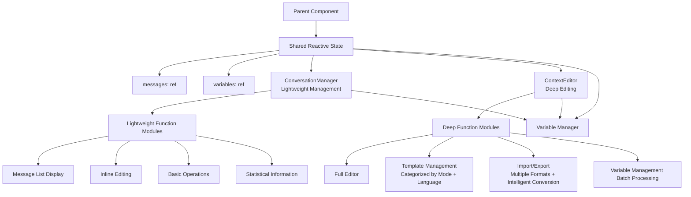

# Context Editor Refactoring - Design Document

## Overview

This design document defines the technical implementation plan for the context editor architecture refactoring based on the "lightweight management of the main panel + deep management of the full-screen editor" division of labor model. The refactoring will remove the ConversationMessageEditor and ConversationSection components, simplify the ConversationManager into a lightweight management interface, enhance the ContextEditor into a full-featured editor, and implement bidirectional data binding between the two.

## Guiding Principles Alignment

### Technical Standards
- **Vue 3 Composition API**: Use of the Composition API and reactive system
- **Naive UI Component Library**: Adherence to existing Pure Naive UI design principles  
- **TypeScript Type System**: Strict type definitions and interface specifications
- **Single Responsibility Principle**: Each component focuses on a specific functional domain

### Project Structure
- **Component Modularity**: Components are placed in the `packages/ui/src/components/` directory
- **Centralized Type Management**: Type definitions are in `packages/ui/src/types/components.ts`
- **Utility Function Separation**: Reusable logic extracted as composables

## Code Reuse Analysis

### Existing Components to Retain
- **ContextEditor.vue**: Maintain the existing architecture, adding template and import/export functionality
- **ConversationManager.vue**: Simplify the existing implementation, removing complex features
- **Related Composables**: `useResponsive`, `usePerformanceMonitor`, `useAccessibility`

### Components to Remove (After Refactoring)
- **ConversationMessageEditor.vue**: Functionality integrated into inline editing of ConversationManager
- **ConversationSection.vue**: Overly abstract, functionality merged into the user side

### Features to Port from Backup Components
- **Template Management Functionality**: Port from ConversationManager.vue.backup to ContextEditor, categorized by optimization mode and language
- **Import/Export Functionality**: Port from ConversationManager.vue.backup to ContextEditor, supporting multiple formats and intelligent conversion  
- **Intelligent Format Conversion**: Support for formats like OpenAI, LangFuse, Conversation, Smart, etc.

### Integration Points
- **Variable System**: Event communication with the existing variable manager
- **Reactive System**: Vue's reactivity API to implement bidirectional data binding
- **Theme System**: Inherit existing Naive UI theme configuration

## Architectural Design

### Modular Design Principles
- **Single File Responsibility**: ConversationManager focuses on lightweight management, ContextEditor focuses on deep editing
- **Component Isolation**: The two components communicate loosely via shared parent refs
- **Service Layer Separation**: Clear separation of data operations, business logic, and presentation layer
- **Utility Modularization**: Variable scanning, template processing, etc., extracted as independent utility functions

### Data Binding Architecture Diagram



## Components and Interfaces

### ConversationManager (After Refactoring)

#### Core Functions
- **Compact Message List Display**: Inline editing interface suitable for limited space in the main panel
- **Inline Message Editing**: Role selection + text input, integrating basic editing functions of ConversationMessageEditor
- **Basic Operations**: Add, delete, reorder messages
- **Statistical Information Display**: Count of messages, count of variables, count of missing variables
- **Variable Management Integration**: Statistics and missing prompts, quick creation/opening of variable manager events
- **Collapse Function**: Save space
- **Open ContextEditor Entry**: Access advanced features

#### Removed Functions
- Quick template dropdown menu → Moved to ContextEditor
- Import/export button → Moved to ContextEditor
- Sync to test function → Deprecated

### ContextEditor (Enhanced)

#### Retained Functions
- **Tab Architecture**: Message editing/tool management tabs
- **Complete Editing Functionality**: Supports full editing, preview, and variable highlighting/replacement
- **Accessibility Support**: Maintains existing accessibility features

#### New Functions
- **Template Selection/Preview/Application**: Template management categorized by optimization mode (system/user) and language
- **Import/Export Functionality**: Multi-format support, validation + purification, error prompts
- **Intelligent Conversion**: Supports intelligent recognition and conversion for formats like OpenAI, LangFuse, Conversation, Smart, etc.
- **Batch Variable Processing**: Validation and replacement, shared variable functions with Manager

### Data Synchronization Mechanism

#### Bidirectional Binding Implementation
- **Shared Data Source**: Manager and Editor operate on the same parent ref (messages, variables)
- **v-model Synchronization**: Achieved through Vue's reactive system for automatic synchronization
- **Real-Time Reflection**: Any modification in one component is instantly reflected in the other
- **No Save Required**: No additional save steps needed when closing the Editor; all modifications take effect in real-time

#### Variable Management Integration
- **Manager Responsibilities**: Statistics and missing prompts, quick variable creation, opening variable manager
- **Editor Responsibilities**: Batch processing, deep editing, validation and replacement
- **Shared Functions**: Both components share variable functions (scanVariables/replaceVariables/isPredefinedVariable)

## Data Model and API Design

### ConversationManager Props
```typescript
interface ConversationManagerProps extends BaseComponentProps {
  // Bidirectional binding data (directly operate on parent ref)
  messages: ConversationMessage[]
  availableVariables?: Record<string, string>
  
  // Functional functions (provide default implementations)
  scanVariables?: (content: string) => string[] // Defaults to an empty array
  replaceVariables?: (content: string, variables?: Record<string, string>) => string // Defaults to passing through content
  isPredefinedVariable?: (name: string) => boolean // Defaults to false
  
  // UI Control
  title?: string
  readonly?: boolean
  collapsible?: boolean
  showVariablePreview?: boolean
  toolCount?: number
  maxHeight?: number // Limited to number type, internally concatenated with px
}
```

### ConversationManager Emits
```typescript
interface ConversationManagerEvents extends BaseComponentEvents {
  // Data update (v-model bidirectional binding)
  'update:messages': (messages: ConversationMessage[]) => void
  
  // Operation events  
  messageChange: (index: number, message: ConversationMessage, action: 'add' | 'update' | 'delete') => void
  messageReorder: (fromIndex: number, toIndex: number) => void
  
  // Navigation events
  openContextEditor: () => void
  createVariable: (name: string) => void
  openVariableManager: (variableName?: string) => void
}
```

### ContextEditor Props (Newly Added to Existing)
```typescript
interface ContextEditorProps extends BaseComponentProps {
  // Existing properties
  visible: boolean
  state?: ContextEditorState
  showToolManager?: boolean
  
  // Bidirectional binding data
  messages: ConversationMessage[]
  variables: Record<string, string>
  
  // New functional controls
  optimizationMode?: 'system' | 'user' // For template filtering
  enableTemplateManager?: boolean
  enableImportExport?: boolean
  
  // Pass-through functions (shared with ConversationManager)
  scanVariables?: (content: string) => string[]
  replaceVariables?: (content: string, variables?: Record<string, string>) => string
  isPredefinedVariable?: (name: string) => boolean
}
```

### ContextEditor Emits (Retaining Existing)
```typescript
interface ContextEditorEvents extends BaseComponentEvents {
  // UI State
  'update:visible': (visible: boolean) => void
  'update:state': (state: ContextEditorState) => void
  
  // Operation events
  save: (context: { messages: ConversationMessage[]; variables: Record<string, string> }) => void
  cancel: () => void
  
  // Variable management
  openVariableManager: (variableName?: string) => void
  createVariable: (name: string, defaultValue?: string) => void
}
```

## Specific Implementation Strategy

### Phase 1: Simplification Refactoring of ConversationManager
1. **Simplify UI Interface**: Remove UI elements for templates, import/export, and sync functions
2. **Integrate Inline Editing**: Consolidate basic editing functions of ConversationMessageEditor into inline editing
3. **Optimize Data Binding**: Change to directly operate on parent ref, achieving v-model bidirectional binding
4. **Update API Interfaces**: Refactor according to the new Props and Events specifications
5. **Default Values for Functional Functions**: Provide default implementations for functions like scanVariables
6. **Reference Existing Implementations**: Utilize the editing logic from ConversationMessageEditor.vue

### Phase 2: Function Enhancement of ContextEditor  
1. **Template Management Integration**:
   - Add a template selection tab or functional area
   - Display templates categorized by optimizationMode and language
   - Implement template preview and application functionality
   - Port relevant logic from ConversationManager.vue.backup

2. **Import/Export Functionality**:
   - Add import/export entry in the bottom operation bar
   - Implement multi-format support (JSON, CSV, TXT, etc.)
   - Add data validation and purification functionalities
   - Provide user-friendly error prompts

3. **Intelligent Format Conversion**:
   - Support OpenAI API format
   - Support LangFuse tracking format
   - Support standard Conversation format
   - Implement Smart intelligent recognition mode

4. **Data Binding Alignment**: Ensure bidirectional data synchronization with ConversationManager

### Phase 3: Data Binding Layer Implementation
1. **Shared State Design**: Create reactive messages and variables in the parent component
2. **v-model Implementation**: Both child components bind to parent component data through v-model
3. **Real-Time Synchronization Verification**: Ensure modifications in either component are reflected in real-time in the other
4. **Shared Variable Functions**: Ensure functions like scanVariables, replaceVariables behave consistently in both components
5. **Performance Optimization**: Use Vue's shallow reactivity to optimize rendering of large data sets

### Phase 4: Deprecated Component Cleanup
1. **Function Verification**: Thoroughly test all functionalities under the new architecture
2. **Component Removal**: Delete ConversationMessageEditor.vue and ConversationSection.vue
3. **Reference Cleanup**: Update all imports and usages of these components
4. **Type Definition Updates**: Update relevant interfaces in types/components.ts
5. **Final Testing**: Conduct complete regression testing

**Important Note**: Throughout the development process, deprecated components will be retained as references to ensure all functionalities can be correctly migrated. Component cleanup will only occur in the final phase after verifying that all functionalities are working correctly.

## Event Naming Conventions

### Event Binding in Templates
```vue
<template>
  <!-- kebab-case for templates -->
  <ConversationManager 
    @open-context-editor="handleOpenEditor"
    @create-variable="handleCreateVariable"
    @open-variable-manager="handleOpenVariableManager"
  />
</template>
```

### TypeScript Type Definitions
```typescript
// camelCase for type definitions
interface ConversationManagerEvents {
  openContextEditor: () => void
  createVariable: (name: string) => void
  openVariableManager: (variableName?: string) => void
}
```

## Error Handling Enhancements

### Import Data Processing
1. **Format Validation**: Strictly validate the structure and type of imported data
2. **Data Purification**: Clean potential malicious content and invalid fields
3. **Error Prompts**: Provide specific error messages and suggestions for fixes
4. **Rollback Mechanism**: Maintain original data unchanged in case of import failure

### Variable Processing Exceptions
1. **Scanning Exceptions**: Fall back to basic text display if variable scanning fails
2. **Replacement Exceptions**: Maintain original placeholders if variable replacement fails
3. **Circular Reference Detection**: Prevent infinite loops during variable replacements
4. **Performance Protection**: Limit the complexity and time of variable scanning

## Testing Strategy

### Unit Test Focus
- Inline editing functionality of ConversationManager
- Template management and import/export functionality of ContextEditor  
- Synchronization logic of bidirectional data binding
- Default implementations and shared logic of variable functions
- Accuracy of intelligent format conversion

### Integration Test Focus
- Real-time data synchronization between Manager and Editor
- Impact of template application on data
- Complete workflow of import/export
- Cross-component collaboration in variable management

### End-to-End Test Scenarios
- User flow from lightweight management to deep editing
- Selection and application of complex templates
- Import/export and conversion of multi-format data
- Creation and management of a large number of variables

## Performance Considerations

### Rendering Optimization
- Use shallowRef to optimize the reactive performance of large messages
- Lazy loading for templates and import/export functionality
- Support for virtual scrolling (if needed)

### Memory Management
- Timely cleanup of references to deprecated components
- Optimize the reactive listening of bidirectional binding
- Avoid memory leaks caused by circular references

### User Experience
- Maintain smooth interaction at 60fps
- Real-time response for data synchronization
- Batch processing and progress prompts for large data imports